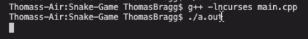
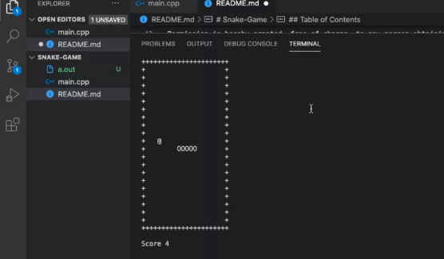

# Snake-Game
Snake Game created in C++ 

##  Repository: 
[Snake-Game](https://github.com/TBragg800/Snake-Game)

## Walkthrough Video Demonstration: 

* YouTube link to the 

[walkthrough](https://youtu.be/aXHI8nWp8UQ)

## Table of Contents
  [Description](#Description)

  [Installation](#Installation)

  [Usage](#Usage)

  [License](#License)

  [Questions](#Questions)
  
## Description
 This project is a terminal snake game written in C++. It uses the ncurses library and was built following the JH & co. tutorial series which can be viewed at https://www.youtube.com/watch?v=OAv2QsOZ4l4. This project was built for the purpose of learning and advancing my knowledge of C++. This code was written to be compatible with Mac operating systems.

## Installation
* Begin by cloning the repo locally.

## Usage
  After installation, the user should navigate to the project directory and run the command 'g++ -lncurses main.cpp' in the CLI. An executable file should now be available. Next, while still in the project directory, the user will execute the executable file by typing the command './a.out' in the CLI. Enjoy the game.

## License
  MIT License

Copyright (c) [2020] [Thomas Bragg]

Permission is hereby granted, free of charge, to any person obtaining a copy
of this software and associated documentation files (the "Software"), to deal
in the Software without restriction, including without limitation the rights
to use, copy, modify, merge, publish, distribute, sublicense, and/or sell
copies of the Software, and to permit persons to whom the Software is
furnished to do so, subject to the following conditions:

The above copyright notice and this permission notice shall be included in all
copies or substantial portions of the Software.

THE SOFTWARE IS PROVIDED "AS IS", WITHOUT WARRANTY OF ANY KIND, EXPRESS OR
IMPLIED, INCLUDING BUT NOT LIMITED TO THE WARRANTIES OF MERCHANTABILITY,
FITNESS FOR A PARTICULAR PURPOSE AND NONINFRINGEMENT. IN NO EVENT SHALL THE
AUTHORS OR COPYRIGHT HOLDERS BE LIABLE FOR ANY CLAIM, DAMAGES OR OTHER
LIABILITY, WHETHER IN AN ACTION OF CONTRACT, TORT OR OTHERWISE, ARISING FROM,
OUT OF OR IN CONNECTION WITH THE SOFTWARE OR THE USE OR OTHER DEALINGS IN THE
SOFTWARE.

## Questions
  All questions should be submitted to the email listed below. Please consult the GitHub profile or Repo for additional concerns. 
  Email: Ttbbragg83@gmail.com
  Github: [TBragg800](http://github.com/TBragg800)

## Screenshot of deployed application

